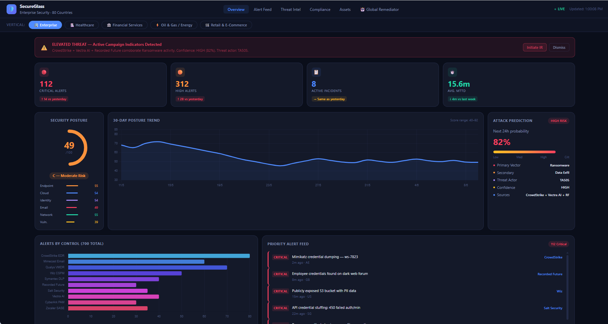
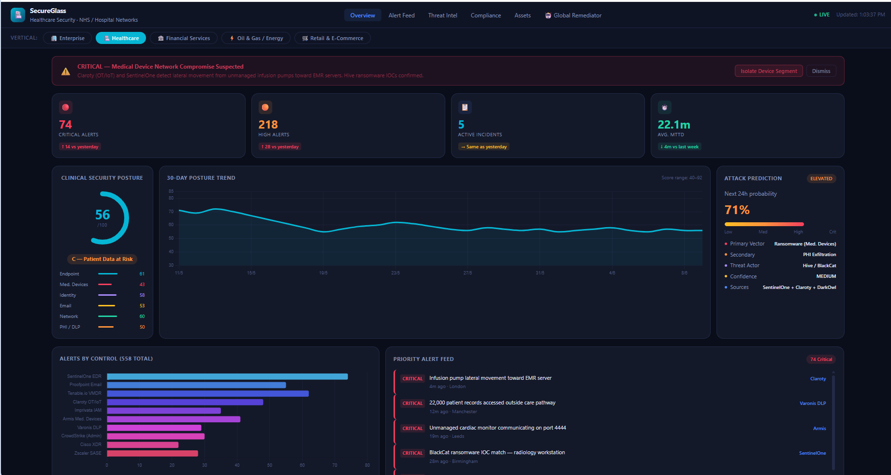

# 🛡️ SecureGlass — Multi-Vertical Security Intelligence Platform

**Enterprise Security · Single Pane of Glass Dashboard · AI-Powered · 5 Industry Verticals**

> A production-grade, AI-assisted security operations dashboard adaptable across five industry verticals. Ingests and correlates alerts from 20 security controls per vertical into a unified CIO/CISO-ready view — no build step, no backend required for the demo.

[](https://manabouprj.github.io/secureglass/)
[](#-industry-verticals)
[](#-security-controls-per-vertical-sample)
[](#-global-remediator--human-in-the-loop-soar)
[](./LICENSE)
[](./docs/HLD.md)
[](./docs/LLD.md)

---

## 📸 Screenshots

> Replace the placeholders below with your own captures. Save images to `docs/screenshots/`
> and they will render automatically. On Windows: use **Win + Shift + S** (Snipping Tool) for
> stills, or **ScreenToGif** for an animated walkthrough cycling through all five verticals.

### Enterprise vertical — Overview


### Vertical switcher in action


### Healthcare vertical — OT/medical-device focus


<!--
To add screenshots:
1. mkdir docs\screenshots
2. Save your PNG/GIF captures there with the names referenced above
3. git add docs/screenshots && git commit -m "docs: add dashboard screenshots" && git push
-->

---

## 🏭 Industry Verticals

Switch between verticals using the **selector bar** directly below the navigation — all data,
tools, compliance frameworks, threat actors, terminology, and executive summaries update instantly.

| Vertical | Focus | Key Threat | Accent |
|----------|-------|------------|--------|
| 🏢 **Enterprise** | Global corp, 80 countries, multi-cloud | TA505 Ransomware | Blue |
| 🏥 **Healthcare** | NHS/Hospital, EHR, Medical Devices | Hive / BlackCat PHI Exfil | Cyan |
| 🏦 **Financial Services** | Global banking, SWIFT, insurance | FIN7 BEC / Fraud | Green |
| ⚡ **Oil & Gas / Energy** | OT/ICS, SCADA, Critical Infrastructure | Sandworm ICS Sabotage | Amber |
| 🛒 **Retail & E-Commerce** | POS, Magecart, CHD, loyalty fraud | FIN6 Card Skimming | Pink |

---

## 🚀 Quick Start

```bash
# Clone the repository
git clone https://github.com/manabouprj/secureglass.git
cd secureglass

# Option 1: Open directly in browser (zero dependencies)
#   Windows:  start frontend\index.html
#   macOS:    open frontend/index.html
#   Linux:    xdg-open frontend/index.html

# Option 2: Local HTTP server
python -m http.server 8080 --directory frontend
# Visit http://localhost:8080

# Option 3: Docker
docker compose up
# Visit http://localhost:8080
```

---

## 🧩 How the Demo Data Works

The dashboard (`frontend/index.html`) is **fully self-contained**. All vertical data lives in an
inline `VERTICALS` configuration object inside the HTML — this is deliberate, so the demo runs
with zero dependencies and works directly from GitHub Pages or a double-click.

The `data/generate_demo.py` script is a **reference implementation** showing the shape of data the
Phase 2 ingestion pipeline will produce (the Common Alert Schema). It generates realistic synthetic
alerts per vertical into JSON. In Phase 2, the dashboard will fetch live data from the API instead
of using the inline object — the generator demonstrates that target format today.

```bash
# Generate synthetic datasets for all five verticals
python data/generate_demo.py
# Outputs: data/demo_<vertical>.json
```

---

## 📊 Dashboard Views

All five views update when you switch verticals:

- **Overview** — Posture ring, 30-day trend, attack prediction engine, priority alerts, regional risk heatmap, MITRE ATT&CK coverage, MTTD/MTTR trend, tool integration status, AI executive summary
- **Alert Feed** — Filterable full event feed (severity + tool) with 180+ synthetic events per vertical
- **Threat Intel** — Active threat actor profiles, IOC summary, dark web / brand monitoring
- **Compliance** — Framework-specific scorecards (8 frameworks per vertical) + 90-day trend
- **Assets** — Coverage gaps across EDR, VMDR, MDM per region/site
- **🤖 Global Remediator** — Human-in-the-loop SOAR approval queue (see below)

---

## 🤖 Global Remediator — Human-in-the-Loop SOAR

The Global Remediator is the orchestration & automation layer that closes the loop between
detection and response. For **every CRITICAL, HIGH, and MEDIUM alert** it drafts a tool-specific
remediation plan and routes it to a human analyst for **Approve / Reject / Defer**.

> **The core guarantee:** the agent never executes autonomously. A human must approve before any
> action runs. LOW and INFO alerts are auto-closed without a prompt.

| Severity | Behaviour |
|----------|-----------|
| 🔴 CRITICAL | Plan + page on-call, **block auto-exec**, require approval (co-sign for OT/medical) |
| 🟠 HIGH | Plan + queue for analyst approval |
| 🟡 MEDIUM | Plan + queue for analyst approval |
| 🟢 LOW / INFO | Auto-close, log only, no human prompt |

Each queued item shows the proposed steps, a blast-radius impact assessment, and an AI confidence
score. Every decision is written to a tamper-evident audit log (SOC 2, ISO 27001, NIST CSF, DORA).
The queue is fully interactive in the demo and repopulates with sector-appropriate plans when you
switch verticals.

📖 Full walkthrough: **[docs/GLOBAL_REMEDIATOR_DEMO.md](./docs/GLOBAL_REMEDIATOR_DEMO.md)**

---

## 🔒 Security Controls (per vertical, sample)

| Capability | Enterprise | Healthcare | Financial | Oil & Gas | Retail |
|---|---|---|---|---|---|
| EDR | CrowdStrike | SentinelOne | CrowdStrike | CrowdStrike | CrowdStrike |
| Email | Mimecast | Proofpoint | Defender O365 | Proofpoint | Proofpoint |
| VMDR | Qualys | Tenable.io | Qualys | Tenable OT | Qualys |
| OT/IoT | — | Claroty | — | Dragos + Claroty | — |
| Fraud | — | — | NICE Actimize | — | Forter |
| SIEM | Sentinel | Splunk | Splunk SOAR | Splunk | Splunk |
| WAF | Cloudflare | F5 | Akamai | Palo Alto ICS | Imperva |
| DLP | Symantec | Varonis | Varonis | — | Symantec |

Full 20-control mapping per vertical in [LLD.md](./docs/LLD.md)

---

## 🔐 Authentication & Access

SecureGlass supports four sign-in methods so it fits any enterprise identity stack. A single login
page offers a local username/password form alongside three enterprise SSO buttons:

| Method | Protocol | Notes |
|--------|----------|-------|
| **Local accounts** | Argon2id + TOTP MFA | Break-glass admin, demo, air-gapped |
| **Microsoft Entra ID** | OIDC / SAML 2.0 | Primary SSO for Microsoft estates |
| **Azure AD** | OIDC / SAML 2.0 | Same product as Entra ID (pre-2023 name) |
| **Okta** | OIDC / SAML 2.0 | For Okta-standardised enterprises |

After login, users are mapped to the existing RBAC roles (**Executive / Senior Analyst / Analyst /
Admin / Read-Only**) via IdP group claims, with fail-closed defaults to least privilege. Role
governs every view — including who may **approve Global Remediator actions** (Senior Analyst and
Admin only). Full design, schema, and OIDC flow in [LLD.md §10](./docs/LLD.md) and
[HLD.md §10](./docs/HLD.md).

> **Working demo login.** The dashboard now ships with a functional client-side login gate and
> enforced RBAC. Try the demo accounts `admin`, `analyst`, `exec`, `auditor` (password `demo`) and
> watch the navigation and Remediator approval rights change per role. Sessions persist across
> refreshes. The SSO buttons perform the real OIDC authorize redirect; the server-side token
> exchange is the Phase 2 backend (LLD §10) — secrets cannot live in a static page.

---

## 📂 Repository Structure

```
secureglass/
├── README.md
├── LICENSE
├── CONTRIBUTING.md
├── docker-compose.yml
├── .env.example
├── docs/
│   ├── HLD.md                  ← High Level Design (architecture, principles)
│   ├── LLD.md                  ← Low Level Design (schema, connectors, algorithms)
│   ├── GLOBAL_REMEDIATOR_DEMO.md ← Human-in-the-loop SOAR feature walkthrough
│   └── screenshots/            ← README images
├── frontend/
│   └── index.html              ← Complete single-file dashboard
├── data/
│   └── generate_demo.py        ← Multi-vertical synthetic data generator
└── src/                        ← Backend (Phase 2)
    ├── ingestion/connectors/
    ├── intelligence/
    └── api/
```

---

## 🗺️ Roadmap

### Phase 1 — Demo (Current)
- [x] 5-vertical switchable dashboard (Enterprise, Healthcare, Financial, Energy, Retail)
- [x] Full HLD and LLD documentation
- [x] Multi-vertical synthetic data generator
- [x] 6-view dashboard with vertical-aware data
- [x] **Global Remediator** — human-in-the-loop SOAR approval queue
- [x] Authentication design (Local, Entra ID, Azure AD, Okta) — HLD/LLD §10
- [x] **Working login gate** — client-side auth, persistent session, enforced RBAC, real OIDC redirect

### Phase 2 — Production Backend
- [ ] FastAPI + PostgreSQL backend
- [ ] Auth service: server-side OIDC token exchange (Entra ID / Okta), Argon2id + TOTP for local
- [ ] Live CrowdStrike, Mimecast, Qualys connectors
- [ ] Claude AI executive summary (live)
- [ ] Global Remediator live plan generation + tool dispatch on approval
- [ ] Dashboard fetches from API instead of inline data
- [ ] Kubernetes manifests (AKS / EKS / GKE)
- [ ] GitHub Actions CI/CD

### Phase 3 — Advanced
- [ ] Remediator: pre-built playbook library per control
- [ ] Slack / Teams approval (approve from chat)
- [ ] PDF report generation (daily / weekly / monthly)
- [ ] Mobile-responsive layout
- [ ] Accessibility: non-colour severity encoding
- [ ] Multi-tenant + white-label per vertical

See the [Issues tab](https://github.com/manabouprj/secureglass/issues) for the live backlog.

---

## 🤝 Contributing

Contributions are welcome. See [CONTRIBUTING.md](./CONTRIBUTING.md) for guidelines.

---

## 📄 License

[MIT License](./LICENSE) — Free for commercial and non-commercial use.

---

*Built for the CIO and CISO of global enterprise organisations. Designed to replace 20 fragmented
security reports with one intelligent, real-time, vertically-aware view.*
